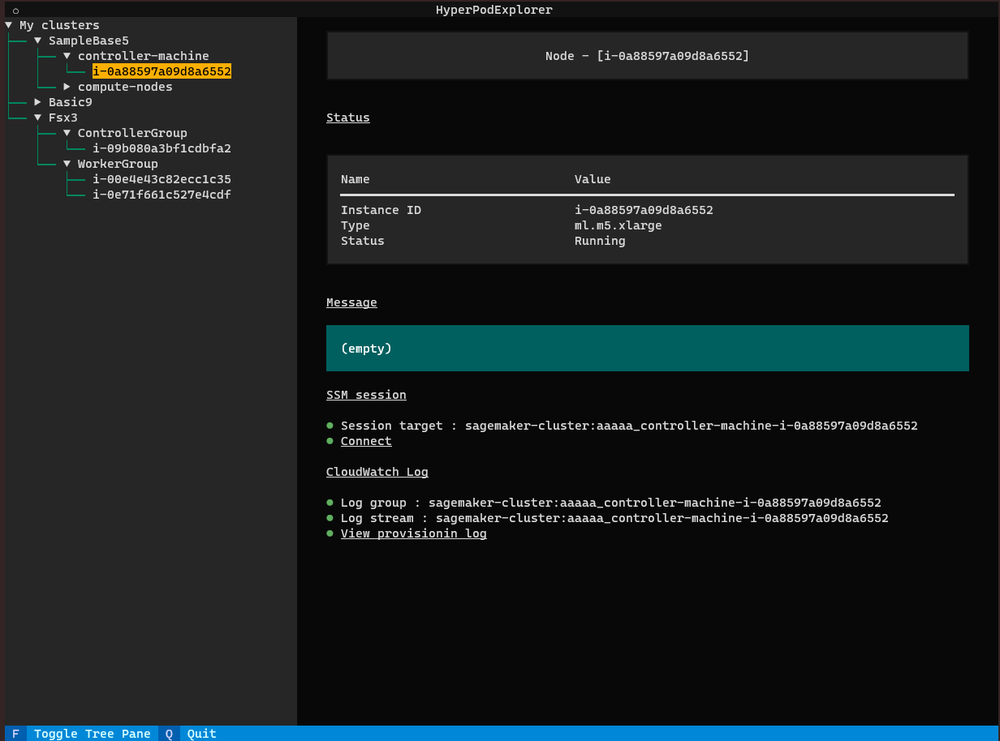

# HyperPod TUI based explorer (WIP)

## Overview

**HyperPod Explorer** is a TUI (Terminal User Interface) based application to browse and manipulate your clusters on [AWS SageMaker HyperPod](https://aws.amazon.com/sagemaker/hyperpod/).

You can access your clusters / instance groups / instances in your clusters in tree structure, see statuses, and login to instances in intuitive manner.

- Intuitive operation with keyboard and mouse.
- Runs just about terminal emulation environment (including VS Code terminal)
- Cross platform - Windows / MacOS / Linux
- Browse HyperPod clusters / instance groups / instances in your AWS account.
- Quickly check statuses of your cluster instances.
- Quickly open SSM sessions to your cluster instances.
- Quickly view CloudWatch Logs about your instances to troubleshoot provisioning issues.




## How to install dependencies

1. Create venv

    ```
    python3 -m venv .venv
    ```

1. Activate the venv
    
    ```
    source .venv/bin/activate
    ```

1. Install dependencies
    
    ```
    pip install textual
    pip install textual-dev
    pip install boto3
    ```

## How to run

1. Activate the venv

    ```
    source .venv/bin/activate
    ```

1. Run

    ```
    make run
    ```

1. Run with dev console

    ```
    make console
    ```

    ```
    make dev-run
    ```